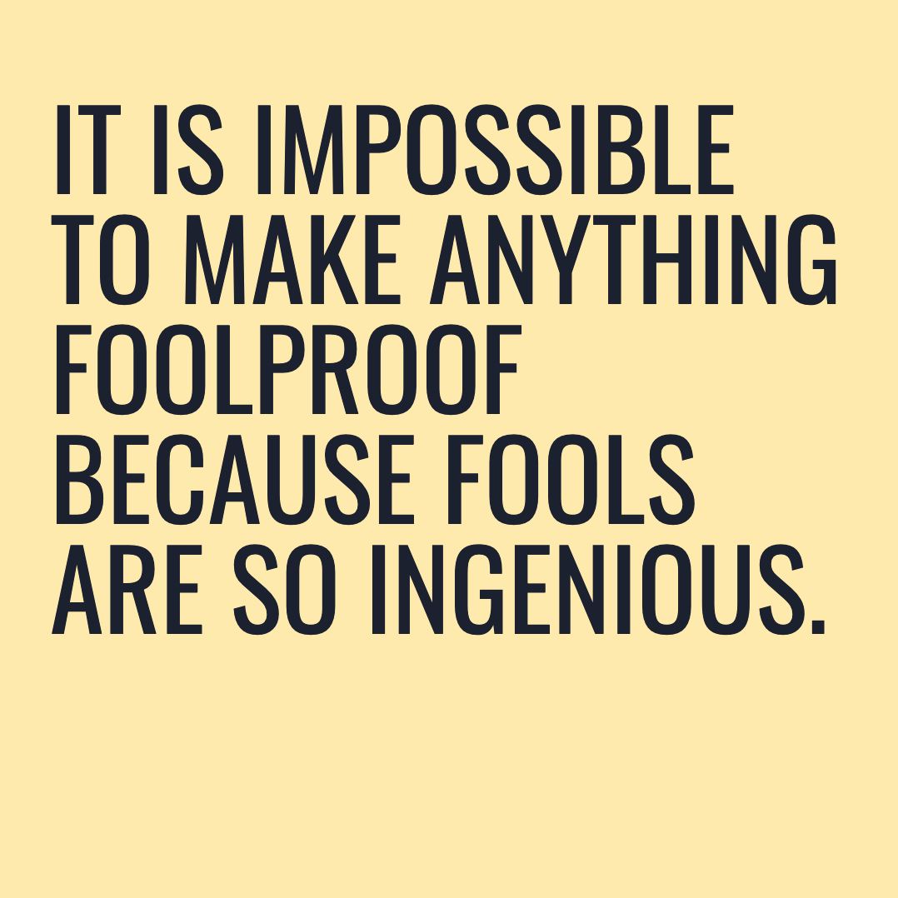

# cc-quote

Creative Coding quote.

<p align="center">
  
</p>

## Quotes?

It's a way to create quick quotes.

This project started in my creative coding 30-days-challenge, but it's also a very good way to experiment with paper sizes, export... so I decided it would be useful to create a different project for this.

## More info

open `docs/index.html` on a server (like [Live Server](https://www.npmjs.com/package/live-server))

## error

```
Cannot process [cc-sketch]: Library cc-sketch is not installed : run 'haxelib install cc-sketch'
Error: Error: Cannot process [hxquicksettings]: Library hxquicksettings is not installed : run 'haxelib install hxquicksettings'
```

```bash
haxelib git cc-sketch https://github.com/MatthijsKamstra/cc-sketch.git
# haxelib install hxquicksettings
haxelib install quicksettings
```

## How?

I started with a 30-day-challenge and created the base for this library. You can see the [code](https://github.com/MatthijsKamstra/creative-coding) I have written and see the [examples](https://matthijskamstra.github.io/creative-coding/)

Creative code library and examples create with [Haxe](http://www.haxe.org) (I'm currently only focussing on the JavaScript target but with Haxe that could easily change). Do you want to know more about this beautiful programming language: [README_HAXE.MD](README_HAXE.MD)!



I created a simple [example](https://matthijskamstra.github.io/cc-quote/).
